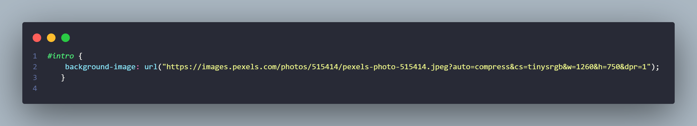
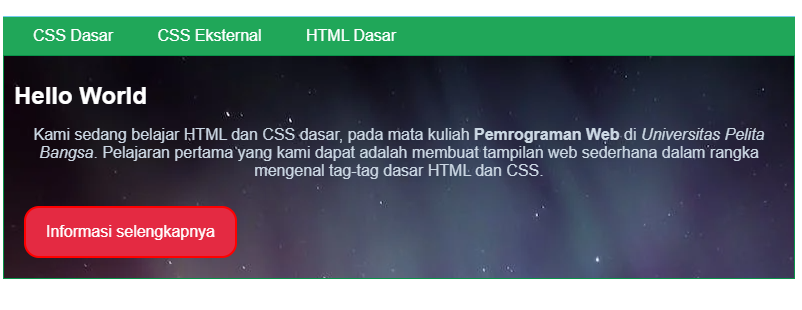

# Pratikum2-CSS

=========================================================================== 

 &#128640 <b>NAMA          :  CHAERUL HIDAYAT</b>&#128640   
  &#128640<b>NIM           :  312210300</b>&#128640  
 &#128640<b>Mata Kuliah   :  Pemrograman Web</b>&#128640  

===========================================================================  

# 1. Di sini saya menambah property background-image pada class #intro
  
Dan ini adalah hasil nya  
 
Di sini kelihatan ada penambahan gambar pada class #intro   
# 2. Perbedaan pendeklarasian CSS elemen h1 dengan #intro h1 adalah
Elemen h1 {...}: Ini adalah deklarasi CSS yang diterapkan pada semua elemen h1 di halaman. Artinya, semua elemen h1 akan menerapkan gaya CSS yang dideklarasikan di dalam blok tersebut. Jika ada beberapa elemen h1 di halaman, semuanya akan tunduk pada gaya yang sama.  
#intro h1 {...}: Ini adalah deklarasi CSS yang diterapkan pada elemen h1 yang berada di dalam elemen dengan id "intro". Ini secara spesifik hanya memengaruhi elemen h1 yang merupakan bagian dari elemen dengan id "intro". Jika terdapat beberapa elemen h1 di halaman tetapi hanya elemen di dalam elemen dengan id "intro" yang akan menerapkan gaya CSS yang dideklarasikan di dalam blok tersebut.

